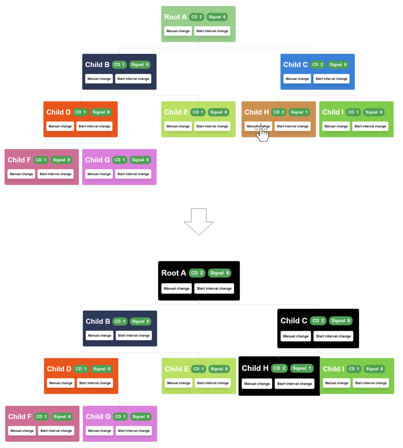

# Angular Change Detection Visualizer

## Overview

This application is designed to visualize how change detection works in Angular applications. It provides a graphical
interface showing a tree of components with counters that increment to indicate change detection cycles and signal
changes. This tool helps developers understand the performance implications of change detection strategies and how
signals propagate through an Angular application.

[

## Features

- **Change Detection Counter (CD)**: Displays the number of times Angular has checked this component and its children
  for changes.
- **Signal Change Counter**: Indicates the number of times a signal has changed in the component.
- **Manual Change Trigger**: Allows you to manually trigger a change in the component, simulating a state change.
- **Interval Change Trigger**: Sets up an interval that periodically triggers a change, simulating recurring state
  changes.

## How to Use

1. **Starting the Application**: Run `ng serve` to start the application and navigate to `http://localhost:4200/` to
   view it in your browser.
2. **Manual Change**: Click the 'Manual Change' button on any component to trigger change detection by increment the
   Signal counter.
3. **Start Interval Change**: Click the 'Start Interval Change' to
   simulate [local change detection](https://github.com/angular/angular/discussions/49684) using PnPush strategy with
   the Signals.
4. **Observing Propagation**: Watch how changes in child components affect parent components.
